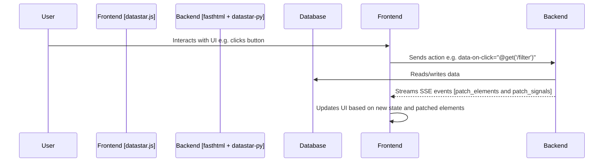

# VeritaScribe Dashboard Rewrite - Architectural Plan

This document outlines the proposed architecture for the rewrite of the VeritaScribe dashboard using `fasthtml`, `datastar`, and `daisyui`.

## 1. Project Structure

A new directory, `dashboard/datastar_app`, will be created to house the new application. This will keep it separate from the existing `fasthtml_app` and `panel_app` during development.

```
dashboard/
|-- datastar_app/
|   |-- __init__.py
|   |-- app.py             # Main fasthtml application
|   |-- components.py      # Reusable datastar components
|   |-- stores.py          # Datastar stores for state management
|   |-- static/
|   |   |-- css/
|   |   |   |-- main.css   # Compiled tailwind/daisyui css
|   |   |-- js/
|   |       |-- datastar.js # datastar client-side library
|-- core/
|   |-- data_processor.py
|   |-- error_manager.py
|   |-- models.py
|   |-- visualizations.py
|-- tailwind.config.js     # Tailwind and daisyui configuration
|-- package.json           # For npm dependencies (tailwindcss, daisyui)
## 2. State Management

Application state will be managed using `datastar` signals. A central state object will be defined in `dashboard/datastar_app/stores.py`. This object will be a simple Python class that holds all the application's state, such as:

*   The currently selected document
*   The list of errors for the selected document
*   The current filter criteria
*   The selected errors for bulk actions

The backend will be the single source of truth. When the state changes on the backend, we will use `datastar-py`'s `patch_signals` function to send the updated state to the client. The client-side `datastar` library will automatically update the UI based on the new state.

Here is an example of what the `stores.py` file might look like:

```python
from dataclasses import dataclass, field
from typing import List, Optional
from dashboard.core.models import ManagedError, FilterCriteria

@dataclass
class AppState:
    selected_document: Optional[str] = None
    errors: List[ManagedError] = field(default_factory=list)
    filter_criteria: FilterCriteria = field(default_factory=FilterCriteria)
    selected_errors: List[str] = field(default_factory=list)

app_state = AppState()
```
## 3. Data Flow

The data flow will be unidirectional, from the backend to the frontend. The backend will be the single source of truth for all data.



**Explanation:**

1.  **User Interaction:** The user interacts with a `daisyui` component on the frontend (e.g., clicks a filter button).
2.  **Action Dispatch:** The `datastar` attribute on the element (e.g., `data-on-click="@get('/filter')"` dispatches an action to the `fasthtml` backend.
3.  **Backend Logic:** The `fasthtml` route handler receives the request, interacts with the `ErrorManager` and the database to fetch or update data, and updates the `app_state` object.
4.  **SSE Stream:** The backend uses `datastar-py`'s `DatastarResponse` to stream Server-Sent Events (SSE) back to the client. These events will contain:
    *   **`patch_elements`:** HTML fragments for any components that need to be updated.
    *   **`patch_signals`:** The updated `app_state` object.
5.  **UI Update:** The `datastar.js` library on the client receives the SSE events and automatically:
    *   Morphs the new HTML fragments into the DOM.
    *   Updates its internal state with the new signals, causing any elements bound to that state to re-render.
## 4. Component Breakdown

The UI will be built from a set of reusable components, defined in `dashboard/datastar_app/components.py`. These components will be simple Python functions that return `daisyui`-styled HTML.

Here is a list of the components that will be needed:

*   **`page_layout(title, *content)`:** The main page layout, including the header, footer, and a container for the page content.
*   **`stats_cards(report)`:** A set of `daisyui` `stats` components to display the high-level statistics for a report.
*   **`filter_sidebar(filter_criteria)`:** A form with `daisyui` `select` and `input` components for filtering the error list.
*   **`error_table(errors)`:** A `daisyui` `table` to display the list of errors.
*   **`error_row(error)`:** A single row in the error table.
*   **`status_badge(status)`:** A `daisyui` `badge` to display the status of an error.
*   **`upload_form()`:** A form for uploading new analysis reports.
*   **`modal(id, title, *content)`:** A generic `daisyui` `modal` component that can be used for various purposes, such as displaying error details or confirming bulk actions.
## 5. Key File Outlines

Here are the skeleton outlines for the main Python files.

### `dashboard/datastar_app/app.py`

```python
from fasthtml.common import *
from datastar_py import attribute_generator as data
from datastar_py.fasthtml import datastar_response
from .stores import app_state
from . import components as c
from ..core.error_manager import error_manager
from ..core.data_processor import DataProcessor
from ..core.models import FilterCriteria, ThesisAnalysisReport

app, rt = fast_app()

@rt("/")
@datastar_response
async def get():
    # Load initial data
    # ...
    return c.page_layout(
        "VeritaScribe Dashboard",
        c.stats_cards(app_state.report),
        c.filter_sidebar(app_state.filter_criteria),
        c.error_table(app_state.errors)
    )

@rt("/filter")
@datastar_response
async def post(filter_criteria: FilterCriteria):
    # Update filter_criteria in app_state
    # ...
    # Get filtered errors
    # ...
    # Update errors in app_state
    # ...
    # Return updated components
    # ...
    pass

@rt("/upload")
@datastar_response
async def post(file: UploadFile):
    # Process uploaded file
    # ...
    # Import report
    # ...
    # Update state
    # ...
    # Return updated components
    # ...
    pass

@rt("/update-status/{error_id}")
@datastar_response
async def post(error_id: str, status: str):
    # Update error status
    # ...
    # Return updated error row
    # ...
    pass

@rt("/bulk-update")
@datastar_response
async def post(action: str):
    # Perform bulk action on selected_errors
    # ...
    # Return updated error table
    # ...
    pass

serve()
```

### `dashboard/datastar_app/components.py`

```python
from fasthtml.common import *
from datastar_py import attribute_generator as data
from .stores import app_state

def page_layout(title, *content):
    return Titled(title,
        Body(
            # Add daisyui layout classes
            # ...
            *content
        )
    )

def stats_cards(report):
    # Use daisyui stats component
    # ...
    pass

def filter_sidebar(filter_criteria):
    # Use daisyui form, select, and input components
    # ...
    pass

def error_table(errors):
    # Use daisyui table component
    # ...
    pass

def error_row(error):
    # Use daisyui table row component
    # ...
    pass

def status_badge(status):
    # Use daisyui badge component
    # ...
    pass

def upload_form():
    # Use daisyui form and file-input components
    # ...
    pass

def modal(id, title, *content):
    # Use daisyui modal component
    # ...
    pass
```